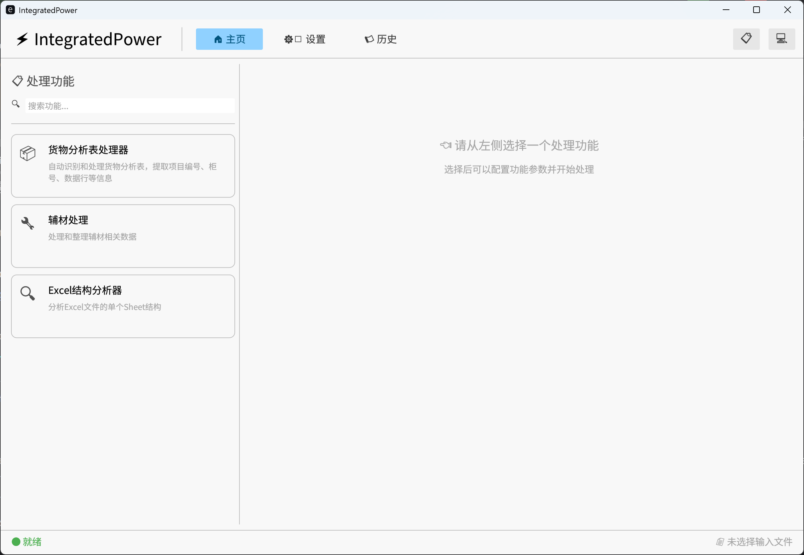
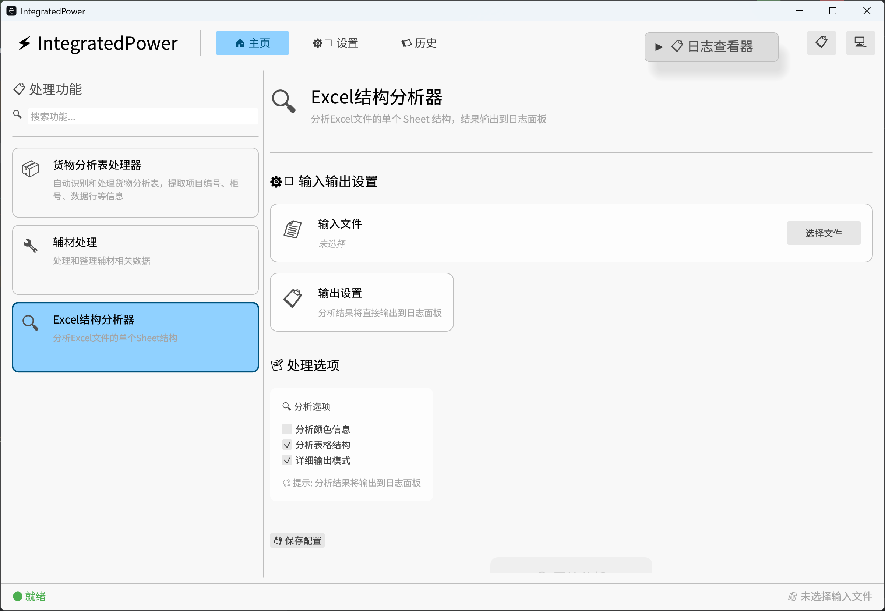

# IntegratedPower

一个基于 Rust 开发的现代化桌面应用程序，使用 egui 框架构建用户界面，并利用 Polars 库进行高性能的 Excel 数据处理。





## 功能特性

- 🎨 现代化的图形用户界面（基于 egui）
- 📊 高性能 Excel 数据处理
- 🔌 插件式处理器架构
- 🤖 智能行类型识别系统
- ⚡ 并行批量文件处理
- 🌓 浅色/深色/系统主题支持
- 📜 操作历史记录
- ⚙️ 灵活的配置管理
- 📦 货物分析表自动处理

## 核心功能

### 行类型识别系统

IntegratedPower 内置了强大的行类型识别系统，能够自动识别 Excel 文件中不同类型的行：

- **项目编号行** - 浅绿色背景，包含项目编号
- **柜号行** - 灰蓝色背景或包含"柜号:"文本
- **表头行** - 浅灰色背景
- **数据行** - 无背景色或白色背景
- **合计行** - 浅粉色背景，区分"单台合计"、"小计"和"总计"

识别系统特点：
- 基于规则引擎，支持颜色、文本模式、单元格合并状态等多种识别条件
- 高度可配置，支持自定义文件类型配置
- 支持规则组合（AND/OR逻辑）
- 优先级机制确保准确识别

### 货物分析表处理器

专门用于处理货物分析表的智能处理器：

- 自动识别表格结构
- 提取项目编号、柜号信息
- 分组处理数据行
- 生成汇总报表
- 支持批量处理

## 技术栈

- **语言**: Rust (edition 2021)
- **UI 框架**: egui + eframe
- **数据处理**: Polars + umya-spreadsheet
- **异步运行时**: Tokio
- **配置存储**: Serde + TOML
- **日志**: tracing + tracing-subscriber
- **错误处理**: thiserror + anyhow

## 项目结构

```
IntegratedPower/
├── src/
│   ├── main.rs              # 应用程序入口
│   ├── app.rs               # 主应用程序逻辑
│   ├── error.rs             # 错误类型定义
│   ├── ui/                  # UI 组件
│   │   ├── home.rs          # 主页视图
│   │   ├── processing.rs    # 处理进度视图
│   │   ├── settings.rs      # 设置视图
│   │   └── log_viewer.rs    # 日志查看器
│   ├── processor/           # 处理器管理
│   │   ├── trait_def.rs     # 处理器 trait 定义
│   │   ├── manager.rs       # 处理器管理器
│   │   └── examples/        # 示例处理器
│   │       └── cargo_analysis_processor.rs  # 货物分析表处理器
│   ├── engine/              # 数据处理引擎
│   │   ├── data_engine.rs   # 数据引擎
│   │   ├── recognition_rule.rs  # 识别规则 trait
│   │   ├── rules/           # 识别规则实现
│   │   │   ├── color_rule.rs        # 颜色规则
│   │   │   ├── text_pattern_rule.rs # 文本模式规则
│   │   │   ├── merge_state_rule.rs  # 合并状态规则
│   │   │   └── composite_rule.rs    # 组合规则
│   │   ├── file_type_profile.rs     # 文件类型配置
│   │   ├── row_identifier.rs        # 行类型识别器
│   │   ├── excel_extractor.rs       # Excel 数据提取
│   │   └── identification_error.rs  # 识别错误类型
│   ├── config/              # 配置管理
│   ├── history/             # 历史记录管理
│   ├── models/              # 数据模型
│   │   └── row_type.rs      # 行类型数据模型
│   └── logger.rs            # 日志配置
├── resources/               # 资源文件
├── image/                   # 文档图片
├── docs/                    # 文档
└── tests/                   # 测试
```

## 构建和运行

### 前置要求

- Rust 1.70 或更高版本
- 无需额外依赖（所有依赖通过 Cargo 自动管理）

### 构建

```bash
# 开发构建
cargo build

# 发布构建
cargo build --release
```

### 运行

```bash
# 开发模式
cargo run

# 发布模式
cargo run --release
```

### 测试

```bash
# 运行所有测试
cargo test

# 运行特定模块的测试
cargo test engine::

# 显示测试输出
cargo test -- --nocapture
```

## 使用指南

### 基本使用流程

1. **启动应用** - 运行程序后进入主界面
2. **选择处理器** - 从可用处理器列表中选择需要的处理器（如"货物分析表处理器"）
3. **选择目录** - 指定输入目录（包含待处理的 Excel 文件）和输出目录
4. **开始处理** - 点击"开始处理"按钮
5. **查看进度** - 实时查看处理进度和日志
6. **查看结果** - 处理完成后在输出目录查看结果文件

### 配置文件

应用配置文件位于：
- Windows: `%APPDATA%\IntegratedPower\config.toml`
- Linux: `~/.config/IntegratedPower/config.toml`
- macOS: `~/Library/Application Support/IntegratedPower/config.toml`

### 日志文件

日志文件位于：
- Windows: `%APPDATA%\IntegratedPower\logs\`
- Linux: `~/.local/share/IntegratedPower/logs/`
- macOS: `~/Library/Application Support/IntegratedPower/logs/`

## 扩展开发

### 创建自定义处理器

实现 `DataProcessor` trait：

```rust
use crate::processor::DataProcessor;
use async_trait::async_trait;
use polars::prelude::*;

pub struct MyCustomProcessor;

#[async_trait]
impl DataProcessor for MyCustomProcessor {
    fn id(&self) -> &str {
        "my_custom_processor"
    }

    fn name(&self) -> &str {
        "我的自定义处理器"
    }

    fn description(&self) -> &str {
        "处理器描述"
    }

    async fn process(&self, df: DataFrame) -> Result<DataFrame> {
        // 实现处理逻辑
        Ok(df)
    }
}
```

### 创建自定义文件类型配置

```rust
use crate::engine::{FileTypeProfile, RowTypeDefinition, ColorRule};
use crate::models::{RowType, RgbColor};

let mut profile = FileTypeProfile::new(
    "my_file_type".to_string(),
    "我的文件类型".to_string(),
);

profile.add_row_type(RowTypeDefinition::new(
    RowType::Header,
    "表头行".to_string(),
    "灰色背景".to_string(),
    Box::new(ColorRule::new(
        "header_rule".to_string(),
        RgbColor::new(200, 200, 200),
        None,
    )),
    9, // 优先级
));
```

## 开发状态

项目正在积极开发中。当前已完成：

- ✅ 核心 UI 框架
- ✅ 数据处理引擎
- ✅ 行类型识别系统
- ✅ 货物分析表处理器
- ✅ 配置管理系统
- ✅ 历史记录功能
- ✅ 日志系统

计划中的功能：

- 🔄 辅材处理器
- 🔄 更多文件类型支持
- 🔄 数据可视化
- 🔄 导出报表功能

## 贡献

欢迎贡献代码、报告问题或提出建议！

## 许可证

待定

## 致谢

感谢以下开源项目：

- [egui](https://github.com/emilk/egui) - 即时模式 GUI 框架
- [Polars](https://github.com/pola-rs/polars) - 快速 DataFrame 库
- [umya-spreadsheet](https://github.com/MathNya/umya-spreadsheet) - Excel 文件处理
- [Tokio](https://github.com/tokio-rs/tokio) - 异步运行时
